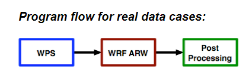
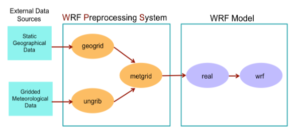

# 02-wrf-tropomi

# WRF / WPS Experiment Notes

This repository contains notes and simple experiments using **WRF / WPS** for atmospheric modeling.

---

## Program Flow (Real Data Cases)





---

## Workflow Overview

1. Prepare data (geographic + meteorological)
2. Run WPS:
   - geogrid
   - ungrib
   - metgrid
3. Run WRF:
   - real.exe
   - wrf.exe

---

## Quick Start

```bash
# Step 1: Run WPS
bash scripts/run_wps.sh

# Step 2: Run WRF
bash scripts/run_wrf.sh
```

---

## Documentation
- docs/WPS.md
- docs/WRF.md
- docs/Data.pdf
- docs/Example.pdf
- docs/Process.pdf

## Notes

This repository is based on personal experiments with:
   - WRF
   - WRF-Chem
   - NCEP meteorological data
