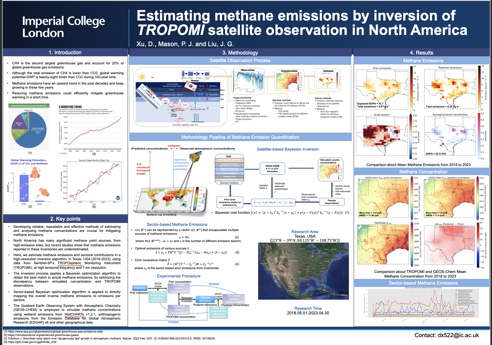

# 03-geoschem-tropomi

## Project Overview

This project performs methane emission inversion using Integrated Methane Inversion (IMI) tool coupled with GEOS-Chem and TROPOMI satellite observations.

The workflow uses TROPOMI methane column concentrations as observational constraints and combines them with GEOS-Chem simulations to optimize methane emissions. The outputs include total emissions, sectoral contributions, and temporal trends.

---

## Poster


---

## Workflow Summary

1. Configure inversion parameters using IMI configuration file  

2. Download required datasets:
   - TROPOMI methane observations  
   - Meteorological data  
   - GEOS-Chem inputs  

3. Run IMI inversion to estimate methane emissions  

4. Perform post-processing:
   - Spatial visualization  
   - Monthly aggregation  
   - Sectoral breakdown  
   - Trend analysis  

---

## Notebooks Description

visualization.ipynb  

`Spatial distribution of methane emissions and comparison between prior and posterior results` 

visualization_month.ipynb  

`Monthly aggregation and mean emission analysis`

sector_month.ipynb  

`Sector-wise emission breakdown`

trend.ipynb  

`Temporal trends of emissions by sector`  

---

## Outputs

- Posterior methane emissions
- Monthly emission statistics
- Sectoral emission breakdown  
- Temporal trend analysis  

---

## Citation

If you use this work, please cite:

```bibtex
@inproceedings{xu2023estimating,
  title={Estimating Methane Emissions by Inversion of TROPOMI Satellite Observations in North America},
  author={Xu, DI and Mason, Philippa J and Liu, Jian Guo},
  booktitle={AGU Fall Meeting Abstracts},
  volume={2023},
  number={216},
  pages={A51O--216},
  year={2023}
}
```

## References and Resources

GEOS-Chem: https://geos-chem.readthedocs.io/en/latest/getting-started/quick-start.html  

IMI Code Repository: https://github.com/geoschem/integrated_methane_inversion  

IMI Documentation: https://imi.readthedocs.io/en/latest/  

Example Configuration: https://imi.readthedocs.io/en/latest/other/common-configurations.html  

Sector-Based Emission Partitioning Reference:

```bibtex
@article{cusworth2021bayesian,
  title={A Bayesian framework for deriving sector-based methane emissions from top-down fluxes},
  author={Cusworth, Daniel H and Bloom, A Anthony and Ma, Shuang and Miller, Charles E and Bowman, Kevin and Yin, Yi and Maasakkers, Joannes D and Zhang, Yuzhong and Scarpelli, Tia R and Qu, Zhen and others},
  journal={Communications Earth \& Environment},
  volume={2},
  number={1},
  pages={242},
  year={2021},
  publisher={Nature Publishing Group UK London}
} 
```